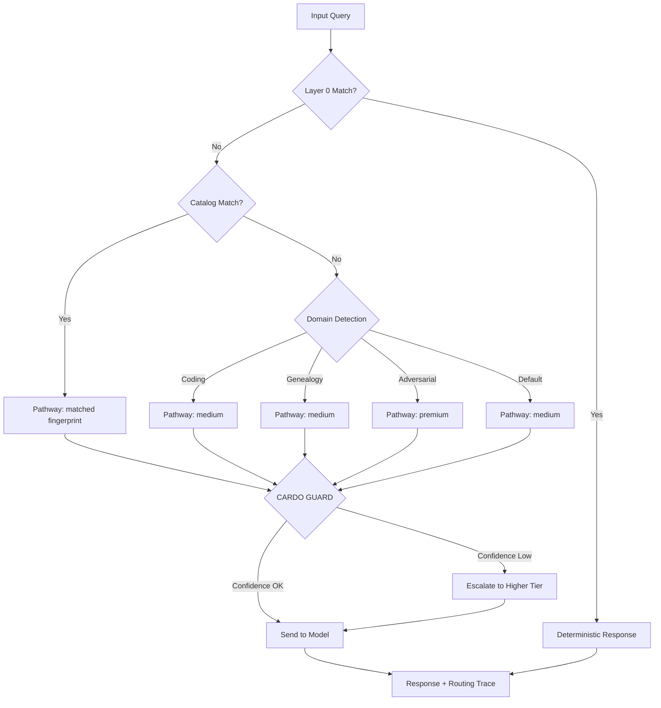

# REI.ai — Adaptive Inference Orchestrator

## Architecture

```
Incoming Query
      │
      ▼
 Layer 0: Deterministic Engine
   (regex · templates · zero-token)
      │
      ▼
 Night Shift Router
   (fingerprint matching · cost-aware)
      │
      ├── Deterministic → $0, 0ms
      ├── Cheap (8B)    → ~$0.0001, ~500ms
      ├── Medium (70B)  → ~$0.0005, ~1s
      └── Premium (GPT) → ~$0.002, ~2s
      │
      ▼
 CARDO GUARD
   (cost-governor: is expensive inference justified?)
      │
      ▼
 Response + routing trace
   (why this pathway? confidence? cost vs premium?)
```

## Decision Flow



## Pathway Tiers

| Tier | Model | Cost/1K tokens | Use case |
|------|-------|----------------|----------|
| Deterministic | None | $0 | Greetings, smalltalk |
| Cheap | llama-3.1-8b-instant | $0.0001 | Translation, simple queries |
| Medium | llama-3.3-70b-versatile | $0.0014 | Reasoning, genealogy, coding |
| Premium | gpt-4o | $0.0125 | Adversarial, high-stakes |

## Cost Model

Every routing decision computes:
- **Estimated cost**: current pathway cost for input + max output tokens
- **Premium cost**: what it would cost if routed to the most expensive model
- **Savings vs premium**: premium cost - actual cost (tracked cumulatively)
- **Alternative routes**: sorted by cost, with per-1K cost deltas and savings %

## Benchmark

57 prompts across 9 categories. Zero inference cost. Deterministic.

Run: `npm test -- --testPathPatterns=routingEval`
